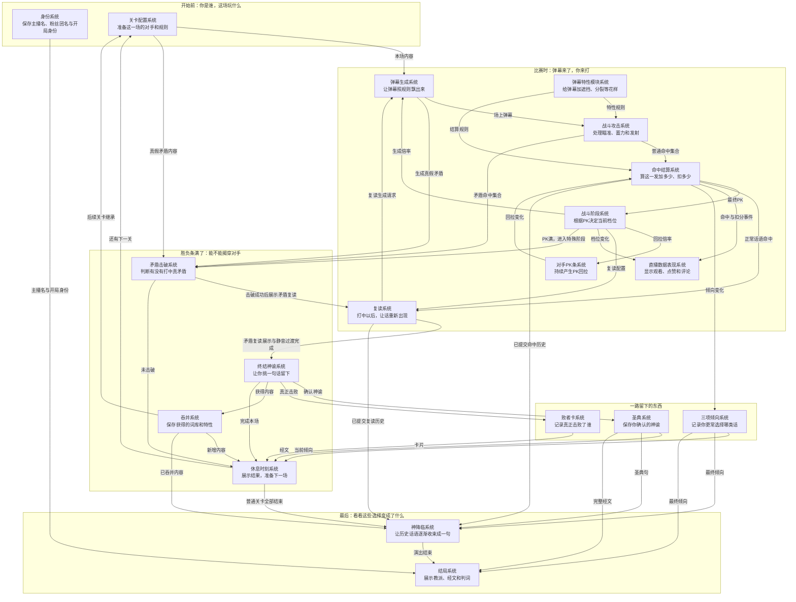

# 各系统协作架构

本文档只说明一件事：**19 个系统分别负责什么，它们之间怎么交数据，整局游戏怎么从开始一路走到结局。**

读这份文档时，可以把每个系统理解成一个“只负责自己那摊事的人”。系统之间通过明确的数据、事件和结果合作。

本文档基于：
- `docs/Original/程序需求汇总.md`
- 当前各系统关联图
- 当前系统编号与目录结构

编号沿用现有系统案。当前没有 11 号系统，所以编号从 10 直接到 12。

---

## 1. 先看懂整局流程

整局游戏可以先记成 5 段：

1. **开局准备**：身份系统决定“你是谁”，关卡配置系统决定“这一场打谁、用什么规则”。
2. **普通战斗**：弹幕生成 → 玩家攻击 → 命中结算 → PK 与档位变化 → 继续生成新的弹幕。
3. **揭穿对手**：PK 打满后进入矛盾击破，成功后进入终结神谕。
4. **保存本场结果**：圣典、败者卡、吞并、倾向保存本场真正成立的成果，休息时刻负责展示并进入下一关。
5. **终局**：普通关卡全部结束后进入神降临，再把一路保存下来的内容交给结局系统。

最重要的一条主流程是：

```text
身份 / 关卡配置
        ↓
弹幕生成
        ↓
战斗攻击
        ↓
命中结算
        ↓
PK / 档位变化
        ↓
继续普通战斗
        ↓
PK 满
        ↓
矛盾击破
        ↓
成功 → 终结神谕 → 保存成果 → 休息 → 下一关
失败 → 休息 → 下一关
        ↓
普通关卡全部结束
        ↓
神降临
        ↓
结局
```

---

## 2. 各数值表是什么位置

“各数值表”不是第 20 个系统。

它是多个系统共同读取的**规则配置来源**，里面放这类数据：

- PK 初始值和范围；
- 升档、降档阈值；
- 回拉速度；
- 弹幕生成数量、速度、寿命；
- 蓄力、硬直、飞行时间；
- 命中收益和异常扣分；
- 复读数量和寿命；
- 矛盾阶段的时限和攻击次数；
- UI 判定尺寸等。

可以把它理解成“统一的游戏参数表”。

程序实现时，具体规则由对应系统执行，数值表负责提供参数。

---

## 3. 19 个系统分别负责什么

| 编号 | 系统 | 自己主要负责什么 | 主要从哪里拿数据 | 主要把结果交给谁 |
| --- | --- | --- | --- | --- |
| 1 | 身份系统 | 玩家主播名、粉丝团名、开局身份、本周目固定身份 | 玩家选择、策划身份配置 | 三项倾向、结局及需要展示玩家侧信息的系统 |
| 2 | 关卡配置系统 | 当前关卡是谁、词库、比例、特殊玩法、生成配置 | 关卡配置、吞并成果、数值表 | 弹幕生成、矛盾击破、关卡流程 |
| 3 | 弹幕生成系统 | 弹幕生成、寿命、同屏数量、来源信息 | 关卡配置、档位、复读请求、吞并内容 | 战斗攻击、直播表现 |
| 4 | 弹幕特性模块系统 | 遮挡、假牌、分裂、反弹等特殊规则 | 关卡配置、吞并内容 | 战斗攻击、命中结算 |
| 5 | 战斗攻击系统 | 准心、蓄力、发射、记录这一发打到了谁 | 玩家输入、场上弹幕、弹幕特性 | 命中结算、矛盾击破 |
| 6 | 命中结算系统 | 算这一发加多少 PK、扣多少 PK、产生什么倾向 | 攻击结果、弹幕特性、数值表、回拉请求 | 战斗阶段、复读、直播表现、三项倾向 |
| 7 | 对手 PK 条系统 | 持续回拉、PK 归零后的失败、重开相关流程 | 当前档位、数值表 | 命中结算、关卡配置 |
| 8 | 战斗阶段系统 | 根据 PK 判断 Tier 0～5，负责普通战斗到矛盾阶段的切换 | 命中结算后的最终 PK | 弹幕生成、对手 PK 条、复读、直播表现、矛盾击破 |
| 9 | 直播数据表现系统 | 观看、点赞、评论、粉丝等直播表现数字 | 命中事件、档位变化、生成和复读事件 | 休息时刻的结果展示 |
| 10 | 复读系统 | 命中后生成复读请求，记录哪些话被复读了多少次 | 命中结算、矛盾击破、档位配置 | 弹幕生成、终结神谕、神降临 |
| 12 | 矛盾击破系统 | PK 满后的特殊阶段，判断有没有打中真矛盾 | 关卡矛盾内容、战斗攻击结果、弹幕生成、数值表 | 复读、终结神谕、休息时刻 |
| 13 | 终结神谕系统 | 从本场话语中给出候选句，确认最终神谕 | 本场命中历史、复读统计、矛盾成功结果 | 圣典、败者卡、吞并、休息时刻 |
| 14 | 吞并系统 | 保存真正击败对手后获得的词库和特性 | 终结神谕确认结果 | 后续关卡配置、弹幕特性、休息、神降临 |
| 15 | 圣典系统 | 保存每关确认的神谕句子和章节信息 | 终结神谕确认结果 | 休息、神降临、结局 |
| 16 | 败者卡系统 | 保存真正击败过哪些主播 | 终结神谕确认结果 | 休息时刻 |
| 17 | 三项倾向系统 | 累计正统、异端、荒谬，并得到最终主导倾向 | 命中结算、开局身份 | 休息、神降临、结局 |
| 18 | 休息时刻系统 | 展示本场已经提交的结果，并决定去下一关还是终局 | 矛盾结果、神谕结果、圣典、败者卡、吞并、倾向 | 关卡配置、神降临 |
| 19 | 神降临系统 | 读取整局历史，完成终局复读收束演出 | 命中历史、复读历史、圣典、吞并、最终倾向 | 结局系统 |
| 20 | 结局系统 | 组合教派、教名、经文、身份比较和判词 | 神降临结果、圣典、倾向、身份 | 最终页面 |

---

## 4. 普通战斗怎么协作

普通战斗最核心的是 3 → 5 → 6 → 8，再反馈回 3。

### 第一步：关卡配置把这一场准备好

【关卡配置系统】先准备本场内容，例如：

- 当前主播是谁；
- 能出现哪些话；
- 三种倾向比例；
- 有哪些弹幕特性；
- 基础生成数量和速度；
- 本关真矛盾和假矛盾；
- 前面已经吞并的词库和特性。

然后把生成需要的内容交给【弹幕生成系统】。

### 第二步：弹幕生成系统把东西放到场上

【弹幕生成系统】负责创建当前场上的弹幕。

每条弹幕至少要知道：

- 自己是哪句话；
- 来源是谁；
- 属于什么倾向；
- 强度是多少；
- 能活多久；
- 有没有特殊特性。

档位提高后，【战斗阶段系统】会给它新的生成倍率。新的弹幕按新倍率生成，已经存在的弹幕继续按自己的原生命周期运行。

### 第三步：玩家发射

【战斗攻击系统】负责玩家的操作过程：

```text
移动准心
→ 按住蓄力
→ 蓄满
→ 松开发射
→ 记录这一发范围内的目标
→ 到达时把命中集合交出去
```

普通战斗的命中集合交给【命中结算系统】。

如果当前已经进入矛盾阶段，攻击结果交给【矛盾击破系统】即时判断。

### 第四步：统一结算这一发

【命中结算系统】是普通战斗的结算中心，也是唯一负责更新玩家 PK 的系统。

它收到一发攻击后，统一处理：

- 正常话语收益；
- 雷、假弹幕、反击等惩罚；
- 反弹、遮挡、落空等异常；
- 同一发多个目标的总收益；
- 最终 PK 变化；
- 正常话语带来的倾向变化。

这里结束后，把最终 PK 交给【战斗阶段系统】判断档位。

【对手 PK 条系统】产生回拉时，也先把回拉变化交给【命中结算系统】更新 PK；PK 更新完成后，再把新的最终 PK 交给【战斗阶段系统】。

这样每次 PK 真正变化后，战斗阶段都能拿到最新值；同一发攻击内部只在整发结算完成后通知一次。

---

## 5. PK 和档位怎么合作

这三个系统关系最容易绕：

- 【命中结算系统】负责统一更新当前 PK；
- 【对手 PK 条系统】负责产生“持续往回拉”的效果；
- 【战斗阶段系统】负责根据最终 PK 判断当前 Tier。

可以理解成：

```text
玩家打中
    ↓
命中结算：PK + 10
    ↓
战斗阶段：看看现在属于哪个 Tier

时间经过
    ↓
对手 PK 条：请求 PK 往回掉
    ↓
命中结算：统一更新 PK
    ↓
战斗阶段：重新看看属于哪个 Tier
```

档位变化后，【战斗阶段系统】再把新档位告诉：

- 弹幕生成系统：后面弹幕怎么生成；
- 对手 PK 条系统：现在回拉多快；
- 复读系统：现在复读多少；
- 直播数据表现系统：直播现在有多热闹。

当 PK 到达满值时，【战斗阶段系统】结束普通战斗并进入【矛盾击破系统】。

---

## 6. 弹幕特性系统放在哪里

【弹幕特性模块系统】可以理解成“给普通弹幕追加特殊规则”。

例如：

- 遮挡；
- 假粉丝牌；
- 不可选；
- 分裂；
- 反弹；
- 带惩罚的复制弹幕。

它主要回答两个问题：

1. **这条弹幕现在能不能正常被选中？**
2. **玩家打到它以后，这次应该算成什么结果？**

【战斗攻击系统】用它判断目标能不能被选中。

【命中结算系统】用它给出的结果计算收益和惩罚。

如果特性需要生成新的弹幕，例如分裂，最终仍然交回【弹幕生成系统】统一放到场上。

---

## 7. 复读系统怎么合作

复读的流程可以直接记成：

```text
打中一句正常话
    ↓
命中结算
    ↓
复读系统收到“哪句话被打中了”
    ↓
根据档位决定复读数量
    ↓
等待一小段随机时间
    ↓
向弹幕生成系统提出复读生成请求
    ↓
弹幕生成系统把复读放回场上
```

复读系统自己负责：

- 原句是谁；
- 要生成多少条；
- 什么时候生成；
- 实际生成了多少；
- 本场哪些句子被复读得最多。

这些统计以后会给【终结神谕系统】和【神降临系统】使用。

复读弹幕进入屏幕后，继续由【弹幕生成系统】管理实例和寿命。

---

## 8. 直播数据表现系统是什么位置

【直播数据表现系统】主要负责“让玩家感觉直播间真的在涨热度”。

它读取：

- 正常命中；
- 陷阱命中；
- 升档；
- 高档状态；
- 弹幕生成；
- 复读生成；
- 矛盾击破；
- 终结神谕。

然后改变：

- 观看人数；
- 点赞数；
- 评论数；
- 粉丝数。

这些数据主要服务于表现和结算展示。

核心战斗继续由 PK、档位、倾向和关卡流程决定。

所以程序看到“点赞变多”时，可以理解成：**战斗结果影响点赞表现**。

---

## 9. PK 满以后发生什么

PK 满后，普通战斗结束，进入【矛盾击破系统】。

矛盾阶段开始时：

1. 普通弹幕和待生成的普通复读被清理；
2. 普通回拉停止；
3. 当前攻击和蓄力状态清理；
4. 读取本关真矛盾和假矛盾；
5. 让【弹幕生成系统】按当前档位生成真假矛盾；
6. 玩家在限制时间和限制攻击次数内发射。

玩家发射后，【战斗攻击系统】把这一发命中了哪些矛盾直接交给【矛盾击破系统】。

结果只有两条主路：

### 打中真矛盾

```text
矛盾击破成功
→ 展示本次矛盾复读
→ 执行一次击破静音过渡
→ 进入终结神谕
```

### 打中假矛盾或打空

```text
消耗一次正式发射机会
→ 还有机会：继续矛盾阶段
→ 机会用完：PK 胜利但未击破
```

### 超时

```text
PK 胜利但未击破
→ 本场没有神谕、败者卡和吞并奖励
→ 直接进入休息时刻
```

也就是说，“PK 打赢”和“真正揭穿对手”是两层结果。

---

## 10. 终结神谕是本场奖励提交点

【终结神谕系统】只在矛盾击破成功后出现。

它读取本场普通话语记录和复读统计，最多给出三句候选。

玩家确认一句后，这一句成为本场神谕。

这次确认会同时产生几类结果：

```text
终结神谕确认
├─→ 圣典系统：保存这一句
├─→ 败者卡系统：记录真正击败的主播
├─→ 吞并系统：保存获得的词库 / 特性
└─→ 休息时刻系统：进入本场结算
```

这里可以把【终结神谕系统】理解成“成功揭穿后的统一奖励提交入口”。

同一场结果只提交一次。

---

## 11. 三项倾向什么时候保存

【三项倾向系统】接收普通战斗中正常话语带来的倾向变化。

战斗过程中可以先累计“本次尝试产生了多少倾向”。

本场 PK 胜利后，这些变化成为已提交记录。

本场战败重开时，本次失败尝试增加的倾向会撤回。

最终它会给出：

- 主导倾向；
- 次要倾向；
- 并列情况；
- 有没有有效行为记录。

开局身份只作为比较参照和并列裁决依据之一。

最终倾向会给【休息时刻系统】【神降临系统】【结局系统】使用。

---

## 12. 休息时刻系统负责什么

【休息时刻系统】主要负责两件事：

1. 把这一场已经成立的结果展示给玩家；
2. 决定接下来去哪。

它会读取：

- 本场胜利结果；
- 新增圣典；
- 新增败者卡；
- 新增吞并内容；
- 当前倾向对应的环境表现；
- 直播数据表现。

还有普通关卡时：

```text
休息时刻
→ 进入下一关
→ 关卡配置系统准备下一名主播
```

普通关卡全部结束时：

```text
休息时刻
→ 神降临系统
```

---

## 13. 吞并怎么影响后面的战斗

【吞并系统】保存玩家真正击败主播后得到的内容。

当前主要有两类：

- 可继承词库；
- 可继承弹幕特性。

下一关开始时：

```text
吞并系统
→ 关卡配置系统读取已获得词库
→ 弹幕生成系统可以混入这些词

吞并系统
→ 弹幕特性模块系统读取已获得特性
→ 后面的关卡可以使用这些特性
```

所以吞并形成的是一个跨关循环：

```text
打败对手
→ 获得对手内容
→ 下一场使用
→ 再打新的对手
```

---

## 14. 圣典和败者卡是什么区别

这两个系统都记录“你一路做过什么”，但记录的东西不同。

### 圣典系统

记录的是：

- 哪一关；
- 哪个主播；
- 玩家最终选中了哪句话；
- 这句话属于什么倾向；
- 章号和节号。

它会参与休息展示、神降临和最终结局。

### 败者卡系统

记录的是：

- 哪个主播被真正击败了。

它主要负责收藏和休息时刻展示。

所以可以简单记：

- **圣典 = 你留下了什么话。**
- **败者卡 = 你真正打败了谁。**

---

## 15. 神降临系统从哪里拿东西

普通关卡全部结束后，【神降临系统】读取已经提交的整局历史。

主要包括：

- 普通话语命中历史；
- 实际复读历史；
- 圣典中的句子；
- 已获得的吞并内容；
- 最终三项倾向。

进入神降临时，这些结果固定下来。

后面的玩家输入主要影响演出强度。

神降临的大流程是：

```text
保持高热度状态
→ 新话越来越少
→ 历史句子不断复读
→ 选出权重最高的一句
→ 只继续生成这句话
→ 画面里这句话占到主要比例
→ 全屏强调
→ 进入结局
```

---

## 16. 结局系统只负责组装最终答案

【结局系统】接收整局已经形成的结果，组合成最后页面。

它会读取：

- 神降临已经结束；
- 三项倾向的最终结果；
- 圣典完整内容；
- 开局身份；
- 玩家主播名。

然后组合：

- 教派主图；
- 教名；
- 经文；
- 身份与最终倾向之间的比较；
- 最终判词。

可以把它理解成“把整局保存下来的数据翻译成一个结局页面”。

---

## 17. 最重要的数据归属

多人一起写系统时，先记住下面这些数据由谁负责。

| 数据 | 主要负责系统 | 其他系统怎么使用 |
| --- | --- | --- |
| 玩家主播名、粉丝团名、开局身份 | 身份系统 | 读取 |
| 当前关卡配置 | 关卡配置系统 | 读取 |
| 当前场上有哪些弹幕 | 弹幕生成系统 | 攻击系统读取目标 |
| 弹幕特殊规则 | 弹幕特性模块系统 | 攻击和结算读取 |
| 当前一次攻击过程 | 战斗攻击系统 | 结束后提交命中集合 |
| 当前 PK | 命中结算系统统一更新 | 战斗阶段读取；对手 PK 条提交回拉变化 |
| 当前 Tier | 战斗阶段系统 | 生成、回拉、复读、表现读取 |
| 观看 / 点赞 / 评论 / 粉丝 | 直播数据表现系统 | 通过 `SaveData.live_session` 读取，供 UI 和休息展示使用 |
| 本场 / 已提交普通话语命中历史 | 命中结算系统 | 神谕读取本场历史；神降临读取已提交历史 |
| 待生成复读和复读统计 | 复读系统 | 弹幕生成、神谕、终局读取 |
| 矛盾阶段成败 | 矛盾击破系统 | 神谕或休息读取 |
| 本场最终神谕 | 终结神谕系统确认 | 圣典和奖励系统接收 |
| 已吞并主播、词库权重与特性 | 吞并系统 | 通过 `SaveData.assimilation_data` 读取；后续关卡、休息和终局使用 |
| 已保存经文记录 | 圣典系统 | 通过 `SaveData.scripture_data.entries` 读取，供休息、神降临和结局使用 |
| 败者卡资料与已获卡片 | 败者卡系统 | 静态资料按主播 ID 查找；通过 `SaveData.loser_card_data` 读取本周目已获 ID，供休息展示 |
| 三项倾向累计与开局比较参照 | 三项倾向系统 | 通过 `SaveData.tendency_state` 保存；休息、终局和结局读取后续提交结果 |
| 当前流程走到哪 | 关卡配置 / 战斗阶段 / 休息 / 神降临按阶段接力 | 各阶段完成后把下一阶段叫起来 |

---

## 18. 两个系统需要合作时怎么写

以后任务卡里遇到跨系统功能，先写清楚 4 件事：

1. **谁先发生事情。**
2. **它把什么数据交出去。**
3. **谁接收。**
4. **接收后要做什么。**

例如“正常命中触发复读”可以写成：

```text
命中结算系统
→ 一发结算完成
→ 提供：原句 ID、结算后档位
→ 复读系统接收
→ 复读系统计算数量和延迟
→ 向弹幕生成系统请求生成
```

这样接手的人不用先看几十个脚本，也能知道功能应该怎么串。

---

## 19. 修改系统接口时怎么处理

如果修改会影响另一个系统，按这个顺序做：

1. 找到数据的负责系统；
2. 找到当前谁在读取它；
3. 写清楚修改前和修改后的数据含义；
4. 更新直接相关系统的实现；
5. 更新对应系统文档；
6. 联调一次完整流程；
7. 在本任务 log 里写清楚这次接口变化。

例如把“档位”从整数改成对象时，需要同时检查弹幕生成、对手 PK 条、复读、直播表现等读取档位的地方。

---

## 20. 双向依赖怎么开发

两个系统互相需要对方时，先分别完成各自不依赖对方的核心任务卡。

双方都已经有稳定输入和输出以后，再执行联调任务卡。

README 里“等某系统”表示当前这张联调卡等待对应接口；同一个系统里其他独立任务可以继续开发。

## 21. 一次提交怎么识别同一场

同一周目里，用当前周目数据 + `level_id` 作为本场结果的唯一身份。

需要“一场只提交一次”的系统都使用这份身份判断，例如：

- 关卡推进；
- 粉丝结算；
- 神谕确认；
- 圣典写入；
- 吞并成果；
- 败者卡；
- 休息结算。

重新打开页面或重新读取结果时，继续读取已经提交的同一场结果。

## 22. 常用术语

- **运行时数据**：当前游戏正在运行时使用的数据。
- **本场暂存**：当前这次关卡尝试产生的数据，PK 胜利后可以提交，失败重开时可以恢复到入关状态。
- **已提交**：已经正式算入本周目结果的数据。
- **原句 ID**：一条原始话语的稳定标识，用它判断多条弹幕是否来自同一句话。
- **联调**：两个已经分别能工作的系统接起来，确认数据真的能从发送方传到接收方。
- **开局身份对应倾向**：身份数据里配置的正统 / 异端 / 荒谬倾向；三项倾向和结局比较都读取这个值。

## 23. 给接手程序的最短阅读顺序

如果你第一次接手一个系统，按下面顺序看：

1. 本文档：先知道它和谁合作；
2. 对应系统目录：知道这个系统自己的具体规则；
3. 对应系统最新任务 log：知道上一个人做到哪；
4. 当前代码：确认仓库现在真实实现；
5. 当前任务卡：开始这一次工作。

只需要先看与你当前系统直接相连的部分。

---

## 24. 主流程 Mermaid


